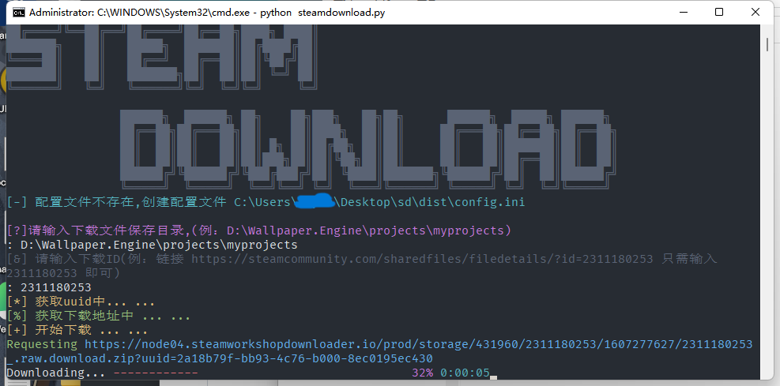
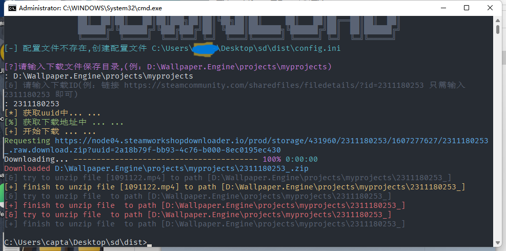

## 🚀采用python编写的Wallpaper_Engine创意工坊下载器

### 🐳环境要求：python>=3.7

1. #### **`python`运行**

> ```bash
> pip install -r requirements.txt
> 
> python steamdownload.py 
> ```

2. **下载[Releases](https://github.com/captain686/Wallpaper_Engine/releases)编译好的exe文件运行**

### 🙈运行截图





#### 🎈**[Notice]**

第一次运行会在本目录下生成`config.ini`文件用于存放下载文件的保存路径信息

由于`exe`文件的编译采用了`pyinstaller`进行的编译，所有会有一定概率报毒，不放心可以自己使用源码的方式运行

`VirsTotal`查杀结果

> https://www.virustotal.com/gui/file/19e179d5c7bedd23aba1de205d5df2ffcfe555a503d3ccce9fb8a9669d2730c3

### 🦽Bug请提 [Issues](https://github.com/captain686/Wallpaper_Engine/issues)

